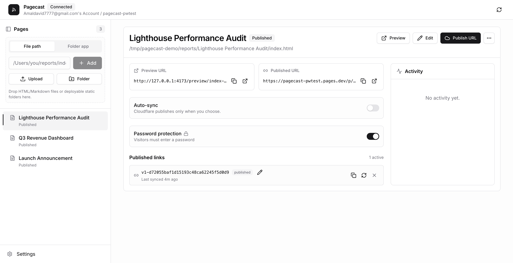

# Pagecast

Preview local HTML reports, Markdown docs, and static mini apps, then publish
them to shareable Cloudflare Pages URLs — from the terminal or your coding agent.

**Live app:** <https://pagecasthq.pages.dev/>

<p align="center">
  
</p>

## About

Pagecast is a local-first publishing tool for agent-generated reports and small
static web projects. Preview files, manage published versions, rename links,
re-sync updates, password-protect pages, and revoke old URLs — from a local
admin UI or headless `pagecast` commands.

**Good fits:** HTML reports and dashboards (Playwright, Lighthouse, coverage);
Markdown plans, docs, and release notes; static mini apps from `dist`/`build`/`out`;
coding-agent workflows that publish a finished artifact on request.

**Not a fit:** private scratch notes, or server-rendered apps that need a running
backend (export static assets first).

## Quick Start

Requires Node.js 20+ and a Cloudflare account (for publishing). No global install:

```sh
npx pagecast
```

This starts the local app and opens the admin UI:

- Admin UI — `http://127.0.0.1:4173`
- Local published-page preview — `http://127.0.0.1:4174` (same `/p/<slug>/` shape it deploys)
- Local data/config — `.pagecast/` in the current directory

In the admin UI, click **Connect Cloudflare**. Pagecast uses scoped Wrangler
OAuth (`account:read`, `user:read`, `pages:write`), detects your account, and
creates the Pages project if needed. From a clone, run `npm start`.

Prefer the terminal?

```sh
npx pagecast pages setup --project pagecast
# multiple accounts? add  --account <account-id>
# automation? export CLOUDFLARE_API_TOKEN (scoped Pages:Edit) + CLOUDFLARE_ACCOUNT_ID
```

## Publish From The Terminal

```sh
# An HTML or Markdown file → a /p/<token>/ link (sibling assets included)
npx pagecast publish "/absolute/path/report.html" --json

# A built static project → publish its entry file
npm run build && npx pagecast publish "$(pwd)/dist/index.html" --json

# A whole folder → deploy directly to a named Pages project (--branch defaults to main)
npx pagecast pages deploy "$(pwd)/dist" --project pagecasthq --json
```

Add `--json` for agents and CI. Use the admin UI for link renaming, re-sync,
revoke, and build settings. Common errors: `statusCode 401` → run `pages setup`
or connect Cloudflare; `statusCode 409` → pass `--account <id>`.

## Password Protection

Gate any published page behind a password — from the admin UI (the **Password
protection** toggle) or headlessly:

```sh
npx pagecast publish "/absolute/path/report.html" --password "your-password" --json
npx pagecast publish "/absolute/path/report.html" --no-password --json   # remove it
```

Enforced at the edge by a generated Cloudflare Pages Function, so it covers every
file of a multi-file report and the page is never served unprotected. Crypto,
security model, and caveats: [PASSWORD-PROTECTION.md](PASSWORD-PROTECTION.md).

## Use From Coding Agents

Pagecast ships a Codex-native skill and a portable Agent-Skills file that offer
to publish finished artifacts — only after you confirm.

```sh
# Codex
cp -R .codex/skills/publish-report ~/.codex/skills/

# Claude Code
/plugin marketplace add Amal-David/pagecast
/plugin install pagecast@pagecast

# Any other agent
cp plugin/skills/publish-report/SKILL.md /path/to/your-agent/skills/publish-report/SKILL.md
```

More detail in [plugin/README.md](plugin/README.md).

## Chrome Extension (Experimental)

> ⚠️ Experimental — load-unpacked only, not yet on the Chrome Web Store.

When an agent opens an HTML file as `file:///…/report.html`, the bundled
extension adds a one-click **Publish to Pagecast** button (the running server
must be up). Install via `chrome://extensions` → **Developer mode** → **Load
unpacked** → select `extension/`, then enable **"Allow access to file URLs"**.
See [extension/README.md](extension/README.md).

## Admin UI Features

- Add `.html`/`.md` files by path or `file:///…` URL, deployable static folders,
  or source folders with a build command and output directory.
- Drag to reorder; publish, re-sync in place, rename links (old links redirect),
  or revoke one/all versions.
- Auto-sync path-backed reports; password-protect pages; edit HTML in-app without
  touching the original source file.

## Security Model

- Admin UI binds to `127.0.0.1`; draft previews are local-only.
- Public access only through active `/p/<token>/` links; revoked tokens 404 after
  the redeploy finishes.
- Public routes reject directory traversal and hidden files. Sibling assets in a
  report's folder can become public if referenced — keep secrets out of it.
- The Pages root publishes no report listing.

## Development

```sh
npm start                  # run the packaged app from source
npm run check && npm test  # verification suite
npm run build              # rebuild the React admin UI (web/) into public/
```

Work on the UI with Vite (`pnpm -C web run dev`, proxied to the server on 4173).
The root CLI/server has no runtime npm dependencies. Layout: `src/` (CLI, server,
publisher), `public/` (built UI), `web/` (React source), `plugin/` +
`.codex/skills/` (agent skills), `test/` (Node tests).

## License

MIT — see [LICENSE](LICENSE). Issues and PRs welcome; run the verification
commands and rebuild `public/` after changing files under `web/`.
